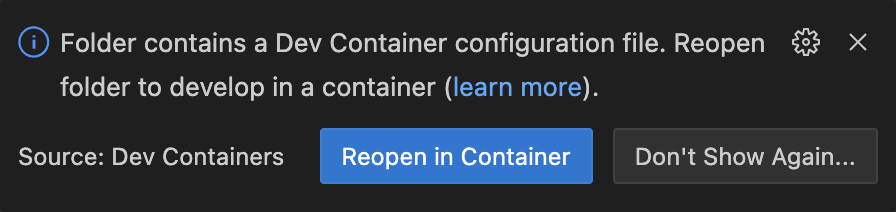
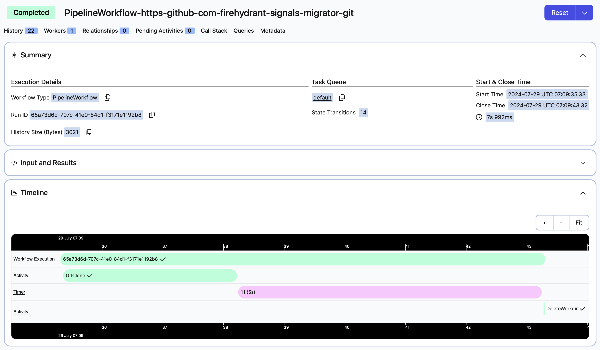

# Technical screener

Welcome! Thanks for considering a position in FireHydrant. This repository contains an exercise for our Senior+ Software Engineer roles.

This is essentially a simplified version of our technical stack. If Rails is _omakase_, then this is _a la carte_ and ordered to be 90% similar to what we use in production.

## What are we building?

**TL;DR** Get creative and build `PipelineWorkflow` in [pipeline/pipeline.go](./pipeline/pipeline.go) as if it's a replacement for continuous integration.

We are building a continuous integration pipeline using Temporal. Imagine if something like GitHub Actions are written in Go, instead of YAML.

> [!TIP]
> You may not already be familiar with all the technologies we use and that's okay. However, if you feel like you have learned something significant at "reading instructions" phase, we recommend letting the "new information" sink in before attempting the exercise. This may look like getting lunch, taking a walk, or sleeping overnight before diving into the exercise.

If you'd like to see an overview of Temporal, check out [PRIMER.md](./PRIMER.md). [Temporal documentation](https://docs.temporal.io) is also a great resource.

## What is the success criteria?

- Running `go run . worker` and `go run . pipeline` still works, just like it does in the boilerplate project.
- Given a YAML file as input for `PipelineParams` in [_examples/simple.yaml](./_examples/simple.yaml), the program should be able to start a pipeline.
- The pipeline should exercise fan-out and fan-in concurrency patterns (e.g. tests don't necessarily depend on linters to finish and vice versa, but deploy should wait on both).
- Try to break workflow determinism and fix it.
- Write tests on what you think is worth testing. Remember to consider the failure modes within the workflow (e.g. if a step fails, what should happen to the rest?).
- And finally, write about your work! We like to see thoughtful work, so please elaborate your reasoning and trade-offs.

We have provided [a sample Go repository](https://github.com/firehydrant-interviews/go-sample) to use where you can easily inject failures to test various scenarios. Feel free to keep using it, fork and add more tags, or use other projects as the target for `git_url` in `WORKFLOW_INPUT` parameter.

## Getting started

We have set up this project to be nearly as launch-ready as we can think of by using [development containers](https://containers.dev) (see [.devcontainer](./.devcontainer)). This means you can use Visual Studio Code, or any editor that supports development containers to develop on this project. Initial build may take some time, but typically should be ready within 5 minutes.

</img>

In it, you will find the development environment to run this code and Temporal development server to manage the workflows. Additionally, a HTTPBin instance as a target to simulate any HTTP server if needed, but don't worry about it if you don't find any use for it! We just don't want you to waste time on setting up authentication / test account / etc.

> [!NOTE]
> Remember to use shell within Visual Studio Code, instead of your regular shell, as we need the commands to be run _inside_ the development container!

### Running boilerplate code

On one terminal session, start a worker with:

```sh
go run . worker
```

Then open another terminal session and queue a workflow execution with:

```sh
WORKFLOW_INPUT=_examples/simple.yaml go run . pipeline
```

With a properly running development setup, you should be able to see the Temporal Web UI at [http://localhost:6434](http://localhost:6434). Find the newly executed workflow in there and it should look like the following:



If all of the above works, you are now ready to develop!
